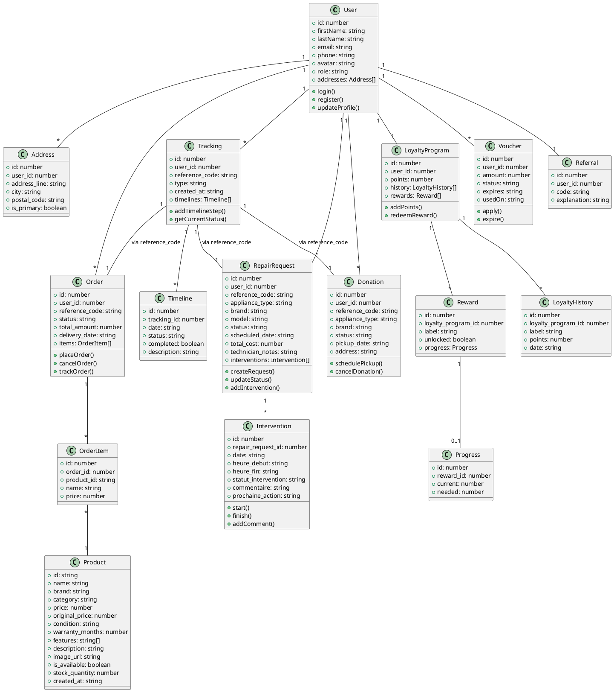
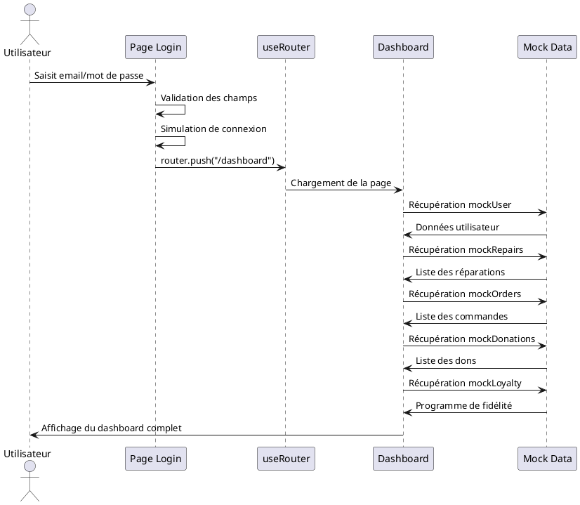
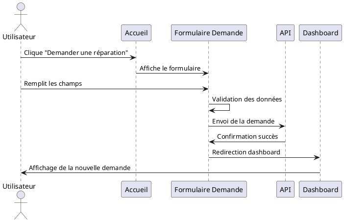

# Conception UML & Merise – Frontend Dédépanne (Version finale)

---

## 1. Diagramme de classes (PlantUML) - Frontend



---

## 2. MCD (Modèle Conceptuel de Données) - Merise

### **Entités et attributs**

**USER**
- id
- firstName
- lastName
- email
- phone
- avatar
- role

**ADDRESS**
- id
- user_id
- address_line
- city
- postal_code
- is_primary

**REPAIR_REQUEST**
- id
- user_id
- reference_code
- appliance_type
- brand
- model
- status
- scheduled_date
- total_cost
- technician_notes

**INTERVENTION**
- id
- repair_request_id
- date
- heure_debut
- heure_fin
- statut_intervention
- commentaire
- prochaine_action
- created_at

**ORDER**
- id
- user_id
- reference_code
- status
- total_amount
- delivery_date
- created_at

**ORDER_ITEM**
- id
- order_id
- product_id
- name
- price
- created_at

**PRODUCT**
- id
- name
- brand
- category
- price
- original_price
- condition
- warranty_months
- features
- description
- image_url
- is_available
- stock_quantity
- created_at

**DONATION**
- id
- user_id
- reference_code
- appliance_type
- brand
- status
- pickup_date
- address
- created_at

**TRACKING**
- id
- user_id
- reference_code
- type
- created_at

**TIMELINE**
- id
- tracking_id
- date
- status
- completed
- description

**LOYALTY_PROGRAM**
- id
- user_id
- points
- created_at

**LOYALTY_HISTORY**
- id
- loyalty_program_id
- label
- points
- date
- created_at

**REWARD**
- id
- loyalty_program_id
- label
- unlocked
- created_at

**PROGRESS**
- id
- reward_id
- current
- needed
- created_at

**VOUCHER**
- id
- user_id
- amount
- status
- expires
- usedOn
- created_at

**REFERRAL**
- id
- user_id
- code
- explanation
- created_at

### **Associations clés**
- USER (1) -- (N) ADDRESS
- USER (1) -- (N) REPAIR_REQUEST
- USER (1) -- (N) ORDER
- USER (1) -- (N) DONATION
- USER (1) -- (N) TRACKING
- REPAIR_REQUEST (1) -- (N) INTERVENTION
- ORDER (1) -- (N) ORDER_ITEM
- ORDER_ITEM (N) -- (1) PRODUCT
- TRACKING (1) -- (N) TIMELINE
- TRACKING (1) -- (1) REPAIR_REQUEST (via reference_code)
- TRACKING (1) -- (1) ORDER (via reference_code)
- TRACKING (1) -- (1) DONATION (via reference_code)
- USER (1) -- (1) LOYALTY_PROGRAM
- LOYALTY_PROGRAM (1) -- (N) LOYALTY_HISTORY
- LOYALTY_PROGRAM (1) -- (N) REWARD
- REWARD (1) -- (0..1) PROGRESS
- USER (1) -- (N) VOUCHER
- USER (1) -- (1) REFERRAL

---

## 3. MLD (Modèle Logique de Données) - Merise

**users** (id, firstName, lastName, email, phone, avatar, role)
**addresses** (id, user_id, address_line1, city, postal_code, is_primary)
**repair_requests** (id, user_id, reference_code, appliance_type, brand, model, status, scheduled_date, total_cost, technician_notes)
**intervention** (id, repair_request_id, date, heure_debut, heure_fin, statut_intervention, commentaire, prochaine_action, created_at)
**orders** (id, user_id, reference_code, status, total_amount, delivery_date)
**order_items** (id, order_id, product_id, name, price)
**products** (id, name, brand, category, price, original_price, condition, warranty_months, features, description, image_url, is_available, stock_quantity, created_at)
**donations** (id, user_id, reference_code, appliance_type, brand, status, pickup_date, address)
**tracking** (id, user_id, reference_code, type, created_at)
**timeline** (id, tracking_id, date, status, completed, description)
**loyalty_programs** (id, user_id, points)
**loyalty_history** (id, loyalty_program_id, label, points, date)
**rewards** (id, loyalty_program_id, label, unlocked)
**progress** (id, reward_id, current, needed)
**vouchers** (id, user_id, amount, status, expires, usedOn)
**referrals** (id, user_id, code, explanation)

---

## 4. MPD (Modèle Physique de Données) - Merise

```sql
-- Table TRACKING
CREATE TABLE tracking (
  id SERIAL PRIMARY KEY,
  user_id INTEGER NOT NULL REFERENCES users(id),
  reference_code VARCHAR(20) UNIQUE NOT NULL,
  type VARCHAR(20) NOT NULL, -- 'repair', 'order', 'donation'
  created_at TIMESTAMP DEFAULT CURRENT_TIMESTAMP
);

-- Table TIMELINE
CREATE TABLE timeline (
  id SERIAL PRIMARY KEY,
  tracking_id INTEGER NOT NULL REFERENCES tracking(id) ON DELETE CASCADE,
  date TIMESTAMP NOT NULL,
  status VARCHAR(100) NOT NULL,
  completed BOOLEAN DEFAULT FALSE,
  description TEXT
);

-- Table INTERVENTION
CREATE TABLE intervention (
  id SERIAL PRIMARY KEY,
  repair_request_id INTEGER NOT NULL REFERENCES repair_requests(id) ON DELETE CASCADE,
  date DATE NOT NULL,
  heure_debut TIME,
  heure_fin TIME,
  statut_intervention VARCHAR(50) NOT NULL,
  commentaire TEXT,
  prochaine_action VARCHAR(100),
  created_at TIMESTAMP DEFAULT CURRENT_TIMESTAMP
);

-- Table users
CREATE TABLE users (
    id SERIAL PRIMARY KEY,
    firstName VARCHAR(100) NOT NULL,
    lastName VARCHAR(100) NOT NULL,
    email VARCHAR(255) UNIQUE NOT NULL,
    phone VARCHAR(20),
    avatar VARCHAR(500),
    role VARCHAR(20) NOT NULL DEFAULT 'client',
    created_at TIMESTAMP DEFAULT CURRENT_TIMESTAMP
);
```

---

**Ce modèle Merise/UML est à jour, exhaustif et conforme à tous les besoins métier et frontend validés.** 

---

## 5. Diagramme de cas d'utilisation (Use Case) - Frontend

```plantuml
@startuml
actor Client
actor Utilisateur_Connecte
actor Admin

rectangle "Frontend Dédépanne" {
  usecase "Consulter la page d'accueil" as UC1
  usecase "Vérifier l'éligibilité code postal" as UC2
  usecase "Demander une réparation" as UC3
  usecase "Faire un don d'appareil" as UC4
  usecase "Consulter les produits reconditionnés" as UC5
  usecase "Filtrer et rechercher des produits" as UC6
  usecase "S'inscrire" as UC7
  usecase "Se connecter" as UC8
  usecase "Accéder au dashboard" as UC9
  usecase "Consulter ses réparations" as UC10
  usecase "Consulter ses commandes" as UC11
  usecase "Consulter ses dons" as UC12
  usecase "Consulter le programme de fidélité" as UC13
  usecase "Consulter ses bons d'achat" as UC14
  usecase "Consulter le système de parrainage" as UC15
  usecase "Suivre une commande" as UC16
  usecase "Se déconnecter" as UC17
}

Client --> UC1
Client --> UC2
Client --> UC3
Client --> UC4
Client --> UC5
Client --> UC6
Client --> UC7
Client --> UC8

Utilisateur_Connecte --> UC9
Utilisateur_Connecte --> UC10
Utilisateur_Connecte --> UC11
Utilisateur_Connecte --> UC12
Utilisateur_Connecte --> UC13
Utilisateur_Connecte --> UC14
Utilisateur_Connecte --> UC15
Utilisateur_Connecte --> UC16
Utilisateur_Connecte --> UC17

Admin --> UC8
Admin --> UC9
Admin --> UC10
Admin --> UC11
Admin --> UC12
Admin --> UC13
Admin --> UC14
Admin --> UC15
Admin --> UC17
@enduml
```



---

## 6. Diagrammes de séquence (PlantUML) - Frontend

### Séquence : Connexion et accès au dashboard



### Séquence : Création d'une demande de réparation

