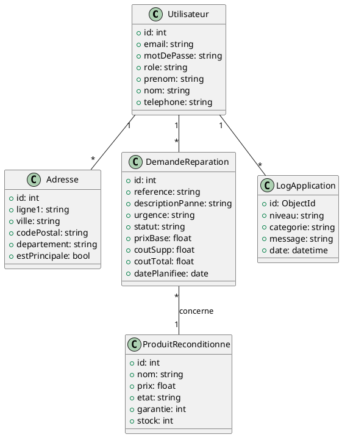
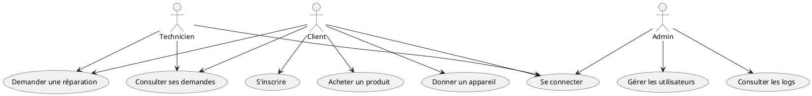
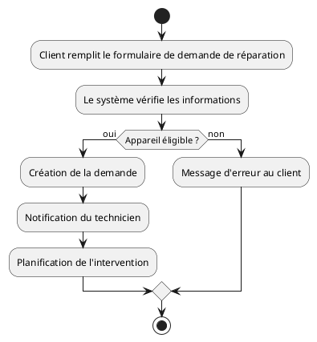

# Conception UML & Merise – Dédépanne

---

## 1. Diagramme de classes (PlantUML)

**Explication :**
Ce diagramme de classes représente les principales entités du backend Dédépanne et leurs relations.

---

## 2. Diagramme de cas d'utilisation (PlantUML)

**Explication :**
Ce diagramme montre les interactions principales entre les acteurs et le système.

---

## 3. Diagramme d'activité (PlantUML)

**Explication :**
Exemple du flux de création d'une demande de réparation.

---

## 4. MCD (Modèle Conceptuel de Données – Merise)

- **Utilisateur** (id, email, motDePasse, role, prenom, nom, telephone)
- **Adresse** (id, ligne1, ville, codePostal, departement, estPrincipale)
- **DemandeReparation** (id, reference, descriptionPanne, urgence, statut, prixBase, coutSupp, coutTotal, datePlanifiee)
- **ProduitReconditionne** (id, nom, prix, etat, garantie, stock)
- **LogApplication** (id, niveau, categorie, message, date)

**Associations :**
- Un utilisateur possède plusieurs adresses
- Un utilisateur effectue plusieurs demandes de réparation
- Un utilisateur peut générer plusieurs logs
- Une demande de réparation peut concerner un produit reconditionné

---

## 5. MLD (Modèle Logique de Données – Merise)

- Utilisateur(id, email, motDePasse, role, prenom, nom, telephone)
- Adresse(id, userId, ligne1, ville, codePostal, departement, estPrincipale)
- DemandeReparation(id, userId, reference, descriptionPanne, urgence, statut, prixBase, coutSupp, coutTotal, datePlanifiee, produitId)
- ProduitReconditionne(id, nom, prix, etat, garantie, stock)
- LogApplication(id, userId, niveau, categorie, message, date)

---

## 6. MPD (Modèle Physique de Données – Merise)

- Table utilisateurs (clé primaire : id)
- Table adresses (clé primaire : id, clé étrangère : userId)
- Table demandes_reparation (clé primaire : id, clé étrangère : userId, produitId)
- Table produits_reconditionnes (clé primaire : id)
- Collection logs_applications (clé primaire : id, clé étrangère : userId)

---

**Tous les diagrammes sont adaptés à l'application Dédépanne et peuvent être exportés ou visualisés avec PlantUML ou un outil Merise.** 